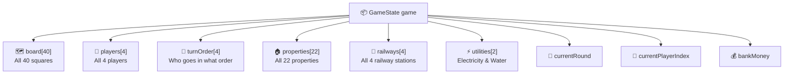
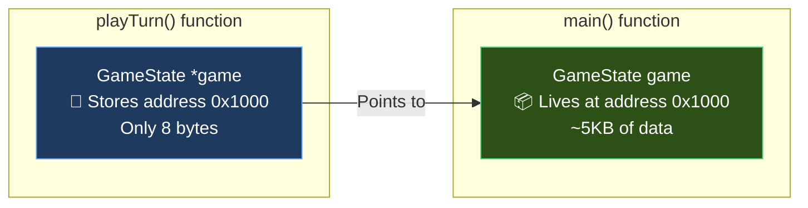
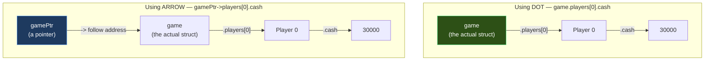
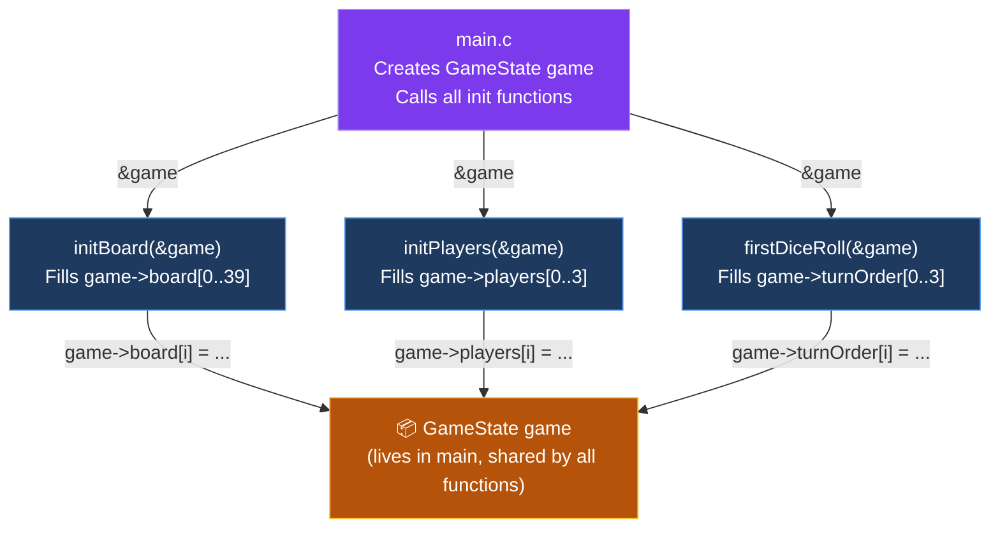

# 🎲 GameState Guide — Structuring Your Monopoly Project

## The Problem: Scattered Data

Right now, your game data lives in **separate global arrays** across different files:

```
board.c  →  Square board[40]        (the board)
player.c →  Player players[4]       (the players)
game.c   →  int turnOrder[4]        (turn order)
```

This works for small programs, but as your game grows, you'll have **dozens of loose arrays** floating around. Functions need access to multiple arrays, and things get messy fast.

## The Solution: One Struct to Hold Everything

Instead of scattering data across files, we put **everything into one struct**:

```c
typedef struct GameState {
    Square board[SQUARE_COUNT];
    Player players[PLAYER_COUNT];
    int turnOrder[PLAYER_COUNT];
    Property properties[PROPERTY_COUNT];
    Railway railways[RAILWAY_COUNT];
    Utility utilities[UTILITY_COUNT];
    int currentRound;
    int currentPlayerIndex;
    double bankMoney;
} GameState;
```

Now in `main()`, you just create **one variable**:

```c
GameState game;    // This single variable holds the ENTIRE game
```

---

## 📦 What's Inside `GameState`?

Think of `GameState` as a **box** that contains smaller boxes:



### Accessing data — use the dot (`.`)

```c
GameState game;

game.players[0].name          // → "Aggressive_Investor"
game.players[0].cash          // → 30000
game.board[5].name            // → "Colombo Fort Railway Station"
game.turnOrder[0]             // → index of who goes first
game.currentRound             // → what round we're on
game.bankMoney                // → how much the bank has
```

---

## 🔑 Pointers — Why and How

### The Problem Without Pointers

`GameState` is a **huge struct**. Let's estimate its size:

| Field | Size |
|-------|------|
| `board[40]` (each Square ≈ 60 bytes) | ~2,400 bytes |
| `players[4]` (each Player ≈ 52 bytes) | ~208 bytes |
| `properties[22]` (each Property ≈ 80 bytes) | ~1,760 bytes |
| `railways[4]`, `utilities[2]`, etc. | ~300 bytes |
| **Total** | **~4,668 bytes** |

If you pass `GameState` to a function **by value** (without a pointer):

```c
// ❌ BAD — copies the ENTIRE 4,668 bytes every time you call this function
void playTurn(GameState game) {
    game.players[0].cash -= 500;  // This modifies the COPY, not the original!
}
```

Two problems:
1. **Slow** — copies ~5KB of data every function call
2. **Changes are lost** — the function works on a copy, the original is unchanged

### The Fix: Pass a Pointer

```c
// ✅ GOOD — passes only the ADDRESS (8 bytes), and modifies the original
void playTurn(GameState *game) {
    game->players[0].cash -= 500;  // This modifies the ORIGINAL
}
```

### What is a Pointer?

A pointer is just a **memory address** — it tells the function **where** the data lives, instead of giving it a copy.



### The Arrow Operator (`->`)

When you have a **pointer** to a struct, you use `->` instead of `.`:

```c
// With a regular variable (dot)
GameState game;
game.players[0].cash = 30000;
game.currentRound = 1;

// With a pointer (arrow)
GameState *gamePtr = &game;
gamePtr->players[0].cash = 30000;
gamePtr->currentRound = 1;
```

> [!TIP]
> **Memory trick**: `->` means "follow the arrow to the data, then access the field."

### Visual: Dot vs Arrow



---

## 🔧 Step-by-Step: How to Restructure Your Code

### Step 1: Add Include Guards to `types.h`

Wrap the entire file with these three lines:

```c
#ifndef TYPES_H       // ← "If TYPES_H hasn't been defined yet..."
#define TYPES_H       // ← "...define it now"

// ... all your existing code (enums, structs, defines) ...

#endif                // ← "End of the guard"
```

This prevents errors when multiple `.c` files include `types.h`.

---

### Step 2: Replace `Game` with `GameState` in `types.h`

At the **bottom** of `types.h` (after all other structs), replace:

```diff
- typedef struct Game{
-     int currentRound;
-     int currentPlayer;
- } Game;

+ typedef struct GameState {
+     Square board[SQUARE_COUNT];
+     Player players[PLAYER_COUNT];
+     int turnOrder[PLAYER_COUNT];
+     Property properties[PROPERTY_COUNT];
+     Railway railways[RAILWAY_COUNT];
+     Utility utilities[UTILITY_COUNT];
+     int currentRound;
+     int currentPlayerIndex;
+     double bankMoney;
+ } GameState;
```

> [!IMPORTANT]
> `GameState` must be defined **after** `Square`, `Player`, `Property`, `Railway`, and `Utility` because it contains them. C reads top to bottom — it needs to know what those types are first.

---

### Step 3: Create an `init` function for the GameState

Instead of initializing arrays as globals in separate files, create functions that **fill in** the GameState:

```c
// board.c
void initBoard(GameState *game) {
    game->board[0]  = (Square){0,  "GO",          SQUARE_GO,       -1};
    game->board[1]  = (Square){1,  "Pettah",      SQUARE_PROPERTY,  0};
    game->board[2]  = (Square){2,  "Community Development Fund", SQUARE_EVENT, -1};
    // ... etc for all 40 squares
}
```

```c
// player.c
void initPlayers(GameState *game) {
    // Use strcpy for the name, then set the rest
    strcpy(game->players[0].name, "Aggressive_Investor");
    game->players[0].position = 0;
    game->players[0].cash = STARTING_CASH;
    game->players[0].inJail = 0;
    game->players[0].jailTurns = 0;
    game->players[0].bankrupt = 0;
    game->players[0].turnOrder = 0;

    // ... repeat for players[1], [2], [3]
}
```

```c
// game.c
int firstDiceRoll(GameState *game) {
    // Instead of players[i], use game->players[i]
    // Instead of turnOrder[i], use game->turnOrder[i]
    // Everything is accessed through game->
}
```

---

### Step 4: Create `main.c` — the entry point

```c
// main.c
#include <stdio.h>
#include <stdlib.h>
#include <time.h>
#include "types.h"

// Declare functions from other files
void initBoard(GameState *game);
void initPlayers(GameState *game);
int firstDiceRoll(GameState *game);

int main() {
    srand(time(NULL));

    GameState game;             // Create the ONE game variable
    game.currentRound = 0;
    game.bankMoney = 100000.0;

    initBoard(&game);           // Fill in the board
    initPlayers(&game);         // Fill in the players
    firstDiceRoll(&game);       // Determine turn order

    // ... rest of game loop ...

    return 0;
}
```

---

### Step 5: Compile everything together

```bash
gcc main.c board.c player.c game.c -o monopoly.exe
```

All `.c` files are compiled and linked into **one executable**.

---

## 🔁 Data Flow Diagram

Here's how data flows through your program:



> [!NOTE]
> The `&` symbol means "address of". When you write `&game`, you're passing the **address** of the game variable — not a copy. This is how the functions can modify the original data.

---

## 🧠 Quick Reference Cheat Sheet

| Concept | Syntax | What it does |
|---------|--------|-------------|
| Create a GameState | `GameState game;` | Allocates the struct on the stack |
| Access a field | `game.currentRound` | Reads/writes a field directly |
| Get address | `&game` | Gets the memory address of `game` |
| Receive a pointer | `GameState *game` | Function parameter that holds an address |
| Access via pointer | `game->currentRound` | Follows the pointer, then accesses the field |
| Access nested | `game->players[0].cash` | Pointer → struct → array → field |

### The Three Symbols You Need

```
.    (dot)    →  "Access a field of this struct"
->   (arrow)  →  "Follow this pointer, then access a field"
&    (ampersand) → "Give me the address of this variable"
```

---

## 📁 Final File Structure

```
Monopoly/
├── types.h        ← All structs, enums, and #defines
├── main.c         ← main(), creates GameState, calls init functions
├── board.c        ← initBoard(GameState *game)
├── player.c       ← initPlayers(GameState *game)
├── game.c         ← firstDiceRoll(GameState *game), game logic
└── .gitignore     ← Ignores .exe files
```

Each `.c` file does **one job** and receives `GameState *game` to access or modify the shared game data. No globals needed!
